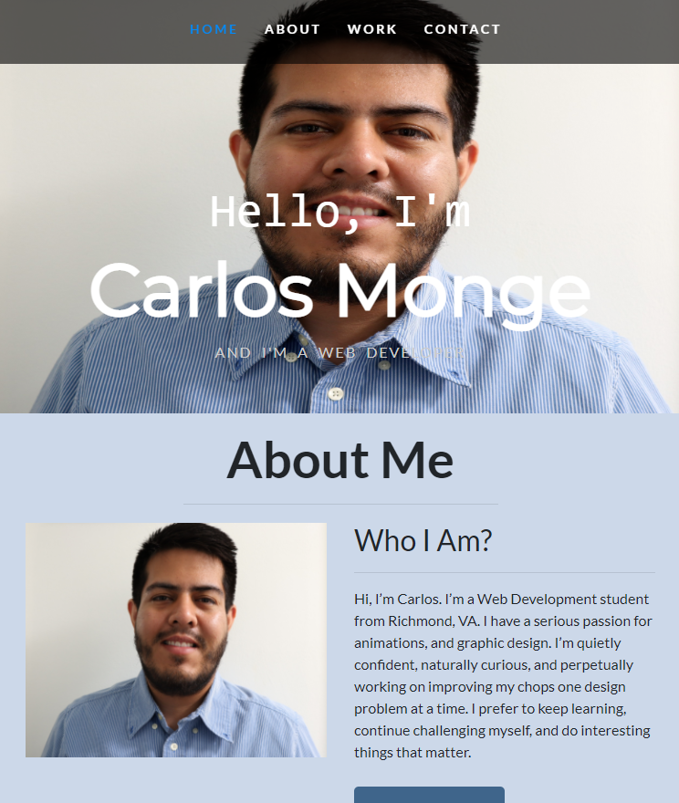

# My Porfolio

## Description

This is an updated portfolio domonstrating some things I've learned about web development.

* I used the hover selector to style the navigation link.

* I used media query to display a responsive layout that resizes on various screens.

## Screenshot

The following image shows the web application's appearance:

## Requirements

* Submit an updated portfolio featuring Project 1 and two exemplary homework assignments.

* Submit an updated GitHub profile with pinned repositories featuring Project 1 and two exemplary assignments.

* Submit an updated resume

* Submit an updated LinkedIn and github profile

## Links

Github Repository: https://github.com/Cmonge135/portfolio

Deployed App: https://cmonge135.github.io/portfolio/